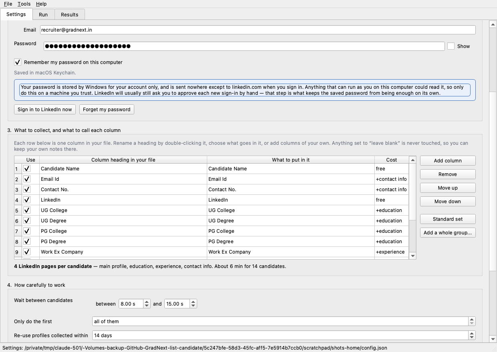

# LinkedIn Enricher

Fills in the blanks in a candidate list from LinkedIn. Point it at a Google Sheet,
an Excel file, or just a list of profile links; choose what each column should
contain; press Start.



---

## On Windows

Double-click **`SETUP.bat`**. It installs everything, builds the app, and puts a
shortcut on your Desktop.

| Script | What it does |
|---|---|
| `SETUP.bat` | Sets everything up, start to finish |
| `DEMO.bat` | Opens the app with example data, no LinkedIn |
| `CHECK.bat` | Reports what is set up, and saves a report to send for help |

`START-HERE.md` is the step-by-step version, `INSTALL-WINDOWS.md` covers the
awkward cases.


## Getting started on Windows

**If someone gave you the built application**, open the `LinkedInEnricher` folder
and double-click `LinkedInEnricher.exe`. There is nothing to install.

**If you have the source code**, double-click **`run_windows.bat`**. The first run
takes a few minutes while it sets itself up; after that it starts straight away.

**To build the .exe yourself**, double-click **`build.bat`** on a Windows PC with
[Python](https://www.python.org/downloads/) installed — remember to tick *"Add
python.exe to PATH"* in the installer. See `INSTALL-WINDOWS.md` for the detail.

On a Mac: `python3 li_app.py`

Want to see how it works without touching LinkedIn? `python3 li_app.py --demo`
replays profiles already saved on this computer.

---

## The three screens

### 1. Settings

- **Where your candidates are** — a Google Sheet link, an Excel/CSV file, or a
  list of LinkedIn links you paste in. *Check I can read it* confirms the app can
  reach your file before you start a long run.
- **Your LinkedIn account** — your sign-in details. These are kept by Windows in
  Credential Manager for your account only, and are sent nowhere except to
  linkedin.com. *Sign in to LinkedIn now* gets any security check out of the way
  before a long run.
- **What to collect** — the important one. See below.
- **How carefully to work** — how long to wait between candidates.
- **Where to save** — folder, file name, and whether to write Excel, CSV or both.

### 2. Run

Start, Pause and Stop; a progress bar; live counters; and a running commentary of
what the app is doing. Everything collected is saved even if you stop early or
LinkedIn interrupts you.

### 3. Results

Every candidate as it completes. Sort by any column, search, and filter down to
the rows that need attention. **Shaded rows are ones the app is not confident
about.** You can correct any value by double-clicking it — your edits are what get
exported.

---

## Choosing your own columns

Each row in the **What to collect** table is one column in your output file.

| Setting | What it does |
|---|---|
| **Use** | Untick to drop the column entirely |
| **Column heading** | Whatever you want it called. Double-click to rename |
| **What to put in it** | Pick from 66 things the app can read from a profile |
| **Cost** | Whether this column makes the app open an extra LinkedIn page |

Add columns with **Add column**, reorder with **Move up / Move down**, or bring in
a whole category at once with **Add a whole group**. A column set to *"leave
blank"* is never touched, so it is a good place for your own notes.

**Start from your own file**: press *Use the column names from this file* and the
app reads your existing headings and works out what each one means. Anything it
does not recognise is left for you to set.

### What can be collected

| Group | Examples |
|---|---|
| **Identity** | Name, headline, location, about, profile link, connections, followers |
| **Contact** | Email, phone, websites, Twitter |
| **Education** | UG/PG college, degree, field, years, highest qualification, all colleges |
| **Experience** | Current title and company, all companies, all job titles, total years |
| **Profile sections** | Skills, certifications, languages, volunteering, projects, awards |
| **Status** | Whether it worked, what was guessed, how confident a name match was |

`python3 enrich_candidates.py --list-fields` prints the lot.

### Only pay for what you ask for

The app opens **only the LinkedIn pages your chosen columns actually need**, and
tells you the cost as you choose:

| What you collect | Pages per candidate |
|---|---|
| Name, headline, location | **1** |
| ...plus current company | **2** |
| The standard nine columns | **4** |
| Everything switched on | **14** |

This matters. Fewer pages means a faster run *and* a much lower chance of LinkedIn
pausing your account. If all you need is each person's current employer, say so and
the run costs a quarter as much.

---

## Things worth knowing

**Email and phone are usually blank.** LinkedIn only shows them when the person
has chosen to publish them, and most people have not. The columns that fill in
reliably are the colleges, degrees and companies. When contact details are not
available the app says so in the Notes column rather than leaving you guessing.

**Finding people by name is a guess.** LinkedIn cannot be searched by email or
phone number. When a row has no link, the app searches the name and records how
confident it is — *high*, *medium* or *low*. A common or one-word name can easily
match the wrong person, so anything short of *high* is shaded for you to check.
Please do check them.

**Your existing data is never overwritten.** Only empty cells are filled in, so
anything you have corrected by hand stays exactly as it is. Your original sheet or
file is never modified either; the app always writes a new one.

**Go gently.** Collecting profile data automatically is against LinkedIn's User
Agreement, and opening a lot of profiles quickly is how accounts get restricted.
The app works one candidate at a time with a pause between each, and warns you if
you set the pace too fast. Please leave it that way.

**Personal data is your responsibility.** Use what you collect only for candidates
who expect to be considered for a role, and in line with your own privacy
obligations.

---

## If something goes wrong

**"LinkedIn has paused this session."** LinkedIn limits how many profiles can be
opened in a short time. Everything collected so far is already saved. Wait an hour
or two and press Start again — profiles already collected are not fetched twice, so
it picks up where it left off.

**It asks you to sign in again.** Sign-ins expire after a few weeks. Just sign in
again in the window that opens.

**"That Google Sheet is not readable without signing in."** Either share the sheet
(*Share → Anyone with the link → Viewer*), or download it (*File → Download →
Microsoft Excel*) and use the file instead.

**"...is open in Excel."** Close the file in Excel and press Export again.

**Anything else.** *Help → Check this computer* produces a summary you can copy and
send on, and *Tools → Open the log folder* has the full record of the last run.

---

## For the command line

The same engine, for scripted runs:

```bash
python3 enrich_candidates.py                             # use the saved settings
python3 enrich_candidates.py sheet.xlsx --limit 5
python3 enrich_candidates.py <sheet-url> --dry-run       # show the plan, collect nothing
python3 enrich_candidates.py --fields full_name,current_company,location
python3 enrich_candidates.py --list-fields
python3 enrich_candidates.py --self-test                 # offline checks, no LinkedIn
```

And to check an installation:

```bash
python3 li_app.py --doctor     # where everything is, what was found; also saves a file
python3 li_app.py --demo       # the whole interface, replaying saved data
```

---

## Where things are kept

Settings, logs, saved profiles and your browser sign-in live in one place per user:

- Windows: `%APPDATA%\GradNext\LinkedInEnricher`
- macOS: `~/Library/Application Support/GradNext/LinkedInEnricher`

*Tools → Open the settings folder* takes you there. Deleting the `chrome-profile`
folder signs you out of LinkedIn; deleting `cache` makes the next run fetch
everything fresh.

## The files in this project

| File | What it is |
|---|---|
| `li_app.py` | The application (Qt interface) |
| `li_engine.py` | The engine: browser, scraping, merging, export |
| `li_fields.py` | Every field that can be collected, and how to read it |
| `enrich_candidates.py` | Command-line version, same engine |
| `tests_engine.py` / `tests_gui.py` | Offline checks — no LinkedIn needed |
| `build.bat`, `LinkedInEnricher.spec` | Build the Windows application |
| `run_windows.bat` | Run from source on Windows |
| `out/` | 37 real profiles used by the offline tests and by `--demo` |
